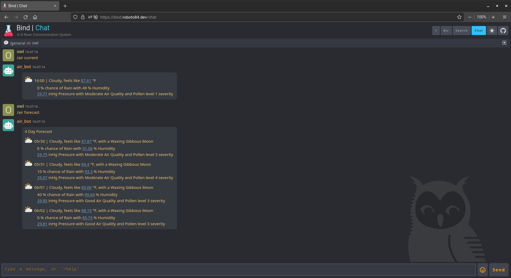

<h1 align="center">air_bot</h1>

	

## About
`air_bot` is a simple chatbot created to bridge the information flow between the **Air** project and the **wh00t** chat app.

## Usage
To see `air_bot` used with **wh00t** on the `roboto_ui` go to the [roboto](https://github.com/roboto84/roboto) repo and follow its README.

	

## Commit Conventions
Git commits follow [Conventional Commits](https://www.conventionalcommits.org) message style as explained in detail on their website.

 

    <a href="https://www.flaticon.com/free-icons/cloud-computing" title="cloud-computing icon">
        air_bot icon created by Freepik - Flaticon
    </a>

